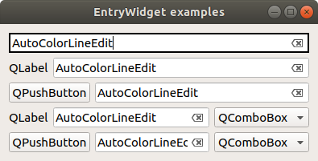

# entrywidget
Data entry PyQt5 QWidget subclasses, for error checking with automatic colors.

## Classes:
    
    AutoColorLineEdit  # QLineEdit with automatic colors
    EntryWidget  # AutoColorLineEdit with DictComboBox[QComboBox] on right side
    

## Installation

    git clone https://github.com/timjolson/entrywidget.git
    pip3 install entrywidget  # (use -e to edit/develop)
    sudo python3 -m entrywidget  # copy QtDesigner plugin file for system-wide use

## doc strings:

#### AutoColorLineEdit
    A QLineEdit with error checking options and automatic color updates.
        Useful signals:
            hasError([]],[object],[str])  # emitted when bool(error status) is True
            errorChanged([],[object],[str])  # emitted when error status changes
            errorCleared  # emitted when bool(error status) is changed to False
            editingFinished  # emitted when Enter/Return pressed or focus is changed out of QLineEdit
            textChanged(str)  # emitted when text changes at all

        All arguments are optional and must be provided by keyword, except 'parent' which can be positional.
        :param parent: Parent Qt Object (default None for individual widget)
        :param errorCheck: callable, returns error status, called with widget as first argument
        :param objectName: str, name of object for logging and within Qt
        :param text: str, starting text
        :param autoColors: dict of tuples of color strings; see help(setAutoColor) for formatting
        :param colors: tuple of color strings/QColor/rgb tuples; see help(setManualColors) for formatting
        :param readOnly: bool, whether the text box is editable
        :param liveErrorChecking: bool, whether error checking occurs
                    after every keystroke (=True) or only after text editing is finished (=False)

#### EntryWidget
    A DictComboBox after an AutoColorLineEdit.
    DictComboBox (.comboBox):
        Set options with obj.setOptions(['opt1', 'opt2', 'op3'])
        Get options with obj.getOptions()
        Set selected with obj.setSelected('opt2')
        Get selected with obj.getSelected()
        Set/unset ReadOnly with obj.setOptionFixed(bool)

    Additional signals (on top of AutoColorLineEdit signals):
        optionChanged([], [str])  # emits newly selected option when selection is changed
        optionIndexChanged([], [int])  # emits new selection index when changed
        dataChanged([], [object])  # emits data attached to new selection

    All arguments are optional and must be provided by keyword, except 'parent' which can be positional.
    kwargs listed here will be passed to constructors of AutoColorLineEdit/DictComboBox

    Widget kwargs
    :param parent: Parent Qt Object (default None for individual widget)
    :param errorCheck: callable, returns error status, called with widget as first argument
    :param objectName: str, name of object for logging and within Qt
    :param readOnly: bool, whether the text box is editable

    QLineEdit kwargs
    :param text: str, starting text
    :param autoColors: dict of tuples of color strings; see help(setAutoColor) for formatting
    :param colors: tuple of colors; see help(setManualColors) for formatting
    :param liveErrorChecking: bool, whether error checking occurs
                after every keystroke (=True) or only after text editing is finished (=False)

    DictComboBox kwargs
    :param options: [str, str, ...] or {str:data, str:data, ...}
    :param optionFixed: bool, whether option is fixed or can be changed

